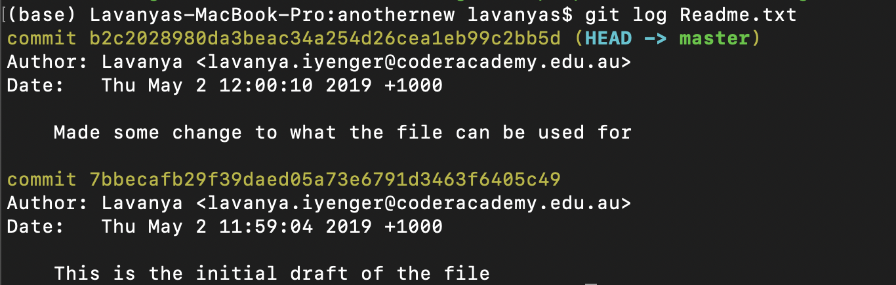
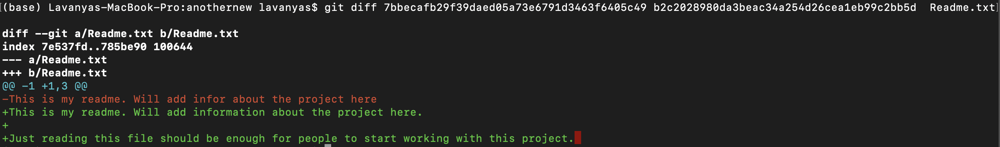
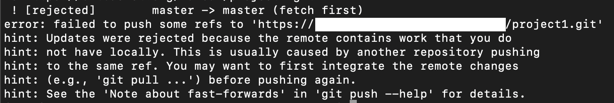

### Git
Git is one of the most widely used version control system. It is an open source project and almost all software projects including huge commercial projects use Git for version control.

## Git installation
The first step to working on git is to get the git software downloaded on your system. To check if your system already has git installed, open the terminal and type, `git --help`. If this returns the list of all command options you have for git, it would mean that git is preinstalled in your machine. If it says the command is not recognized, you will have to install git on your machines. 
Go to https://git-scm.com/download and choose the appropriate one for your computer. 

1. In your computer under any directory you like, create a directory name project1
`mkdir project1`

2. Change over to the directory you just created.
`cd project1`

3. Now we will have to init the directory you just created as a git repository to be able to harness the goodness of git versioning system.
`git init`

4. We will create a text file to start with. Let's call it, Readme.txt. Use an editor in your computer to do this and save it project1 directory. 

5. Now we have to tell git that the Readme.txt file is going be a part of the repository so that git can maintain versions of the file, every time we make changes. This is done just the first time when git has no idea about the file at all. 
`git add Readme.txt`

6. `git add` only marks the file for inclusion in the repository. Git doesn't yet start maintaining versions. Once we have added the file to git repository, we have to commit it with a meaningful message so that at a later point of time when you look at all the messages, you know who made what changes for what purpose. Only after committing, git maintains the versions. 
`git commit -m "This is the initial draft of the file" Readme.txt`

7. Now make some changes in the Readme.txt. We will now have to commit the changes, for git to keep track of it.
`git commit -m "Made a few changes to the file" Readme.txt`

8. To see how many versions of the file were created and who made the changes on what day and time, git offers a special 'log' command. Type and execute the following command and infer what it says.
`git log Readme.txt`

9. Each commit is assigned a unqiue id. To see the difference between two versions we can copy the unique commit id from the log and check the differences. 
`git diff <unique commit id 1> <unique commit id 2> Readme.txt`

   The green lines with the plus indicate what has been added in the newer version and the red line with a minus indicated what has been removed from it.

   But now the file is local to your machine. It is not available remotely yet. So no one other than you can actually work on the file. But the whole purpose of Git is not just to maintain versions but also to collaborate and work. To do this, we need a remote repository. There are many git repository hosting services available. Many of them offer free option in their package. Github is the most popular remote repository hosting service. Other options available may be explored [here.](https://itsfoss.com/github-alternatives/)

   Create a Github free account and log into your account. Once you create an account and verify your email id, you can also follow the guide provided by Github to learn the basics following this link https://guides.github.com/activities/hello-world/

10. On github.com click on ["Create new repository"](https://github.com/new) and create a repository named project1. This will create a remnote repository and give you http link to the repository which will look like this. `https://github.com/<your git username>/project1.git` . This is going to represent the project1 folder we created in our system. To do this we execute the following command from the project1 folder on your system
`git remote add origin https://github.com/<your git username>/project1.git`

11. We will now push the code to the remote repository using the following command.
`git push -u origin master`

   Now when we check our remote repository, all the files will be available there along with the commit and version details.

12. Make some changes to the Readme.txt again and commit it and push it. 
`git commit -m "Made more changes to the file" Readme.txt`
`git push -u origin master`

   All the changes you did will also be reflected in the remote repository. 

13. Now try to change the file remotely and commit through the github portal. This means the the remote repository has a different version and your local machine is not up-to date with the remote repository. Make changes in the local machine to the same file now and try a commit and push, just like how you did in step 12. It would not let you push as the versions on local machine and the remote machine are not consistent.

