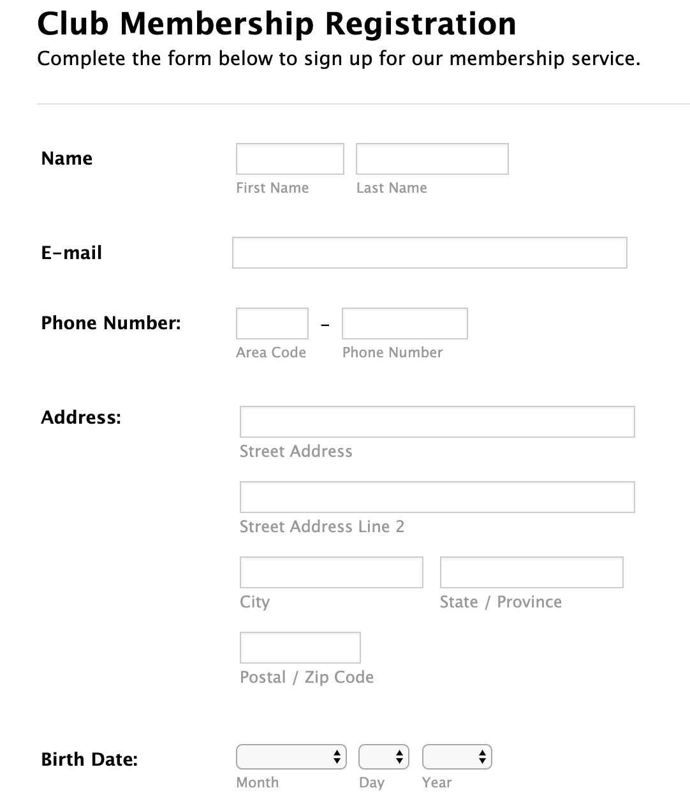
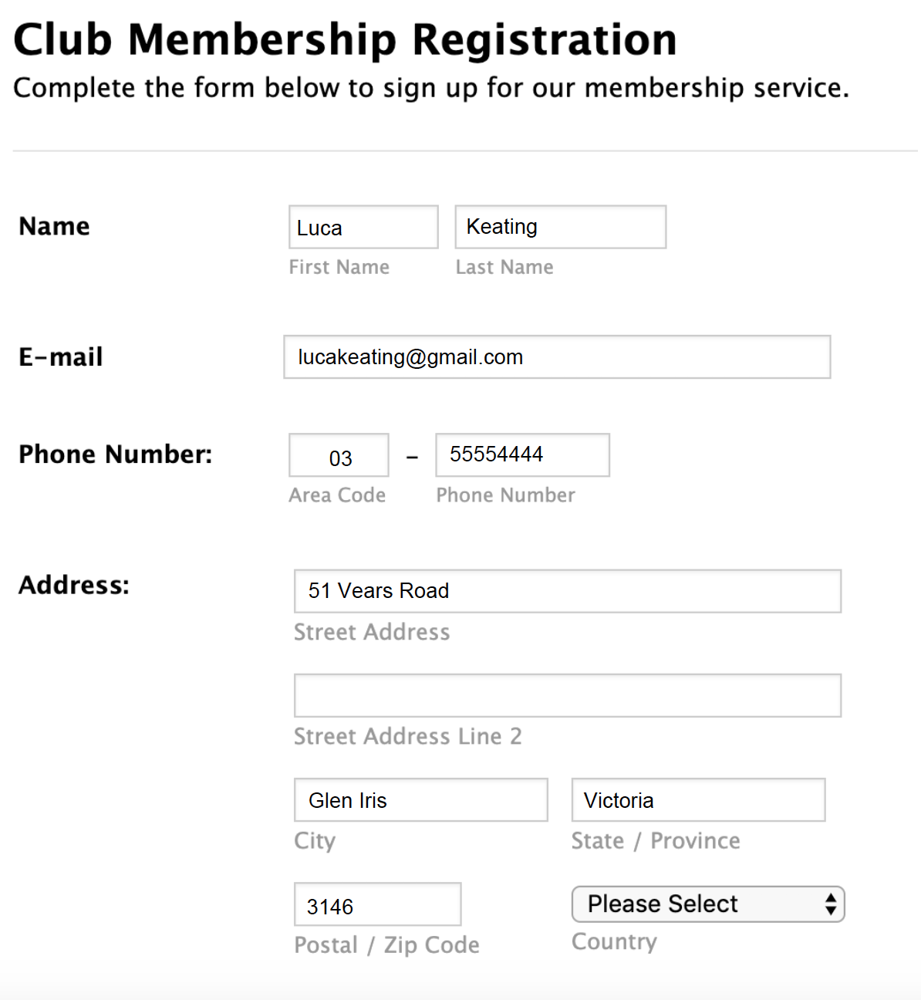

### Before the master class you must have

* Java 1.8 or above installed in your computer. On your terminal, type “java –version” to determine that you have the right version
* Install SpringToolSuite from spring.io https://spring.io/tools3/sts/all which is meant for your operating system
(We will spend a while initially to make sure everyone has the installation in place before proceeding to learn)


### Class in Java 

In python, you may recollect everything is a module. Everything in Java is a class. Literally everything. When you write the simplest traditional application to print *Hello World*, even that is a class. It is called a Runnable Class. 

#### How to create a class

Let's write our first Runnable class in the following link and try it out.

https://www.tutorialspoint.com/compile_java_online.php


 ```
 public class MyFirstRunnableClass {
    public static void main(String s[]) {
        System.out.println("Hello World");
    }
}
 ```
 
 Try a few things:
 1. Try removing the word public in the class. 
 2. Try switching public and static in the main method. 
 3. Try removing the word public in the main method.
 4. Try removing the word static in the main method.

### Things you should know about Java
1. To run a class it has to be a public class
2. You run a runnable class with its classname `java <name of the class>`
3. The class should have a public static void main method which takes a String [] argument.
4. The String [] argument is nothing but the command line arguments you give the class when you run it. You can refer to the string array with any variable name. Commonly used ones as s and args.
5. A class has to be written in a file with the extension Java.
6. A class is first compiled and then run. A class can be compiled on one system and run on another system - Platform independence 
7. When you compile a .java file, it produces a .class file with the same name if the compilation is successful. The .class file contains bytecodes (non-human readable form) which can be interpreted by an Operating System which has Java Runtime Environment set up. 
8. Most computers in the modern days have Java Runtime Environment.


### JVM 
JVM stands for Java Virtual Machine. It is a Virtual Machine which understands bytecodes and can load a class object, allocate and manage memory for all the objects which are in-turn required. The analogy is like a Windows Media player application which knows to read mp3 files and produce music from it. JVM is not platform independent. There is JRE for each kind of operating system. They `java` application in the JRE starts the JVM.

In the example we saw above, can you identify the classes that would be loaded in the JVM?

### OOPs they did it again:

Object Oriented Programming as the name says is based on Objects. What are objects? Objects are instances of a class. 

Classes are more like reusable templates. Look at the images below.







### Members of a class
A class can have attibutes, methods and special methods called constructors.

Attributes are distinct features of the class. The attributes can be public, protected, private or default (default is when you specify nothing; don't actually write the word default). Attibutes can be static or non-static (again, non-static is when you give nothing; don't actually write the word non-static). Static like the word implies, will have the same value for all the instances of the class. When a member is non-static, it will have a different value for each object.

```
public class APEmployee {
	priavte String name = null;
	private String emp_code = null;
	private static String companyName = "Australia Post";
}
```

#### Template for attribute definition:
<access modifier> <non-access modifier> <data type> <variable name> = <initial value>;
	

Methods are callable functions you can call on the objects of the class. They can be doing simple things like printing a message or a very complex thing. Most modern day IDEs will have generator for standard methods which are expected to be in a class.


When we ran a class we loaded the class. 
The idea of making it all classes was to make it reusable to the best possible extent.


public class Customer {
	
	String name;
	String email;

}
```
The attributes and methods of a class can have different access. They can be public, private, protected or when nothing is mentioned, have default access. Most attributes of a class are kept as private members. 
